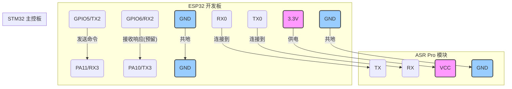

# ASR Pro - STM32 硬件接线说明

本文档提供了ASR Pro语音识别模块(ESP32)与曼波机器狗主控板(STM32)之间的硬件连接指南。

## 1. 所需组件

- **ESP32开发板**: 例如ESP32-WROOM-32。
- **ASR Pro语音识别模块**: 用户实际使用的离线语音识别模块 (例如SU-03T)。
- **STM32主控板**: 曼波机器狗的主控制板 (STM32F103C8T6)。
- **杜邦线**: 若干，用于连接。

## 2. 接线图

下图简要说明了ESP32、ASR Pro模块和STM32之间的连接关系。

## 3. 连接说明

### 3.1 ESP32 与 ASR Pro 模块连接

ASR Pro模块通常通过串口与微控制器通信。请将其连接到ESP32的一个硬件串口上（例如`Serial1`或`Serial2`）。**请勿使用`Serial0`**，因为它用于程序下载和调试输出。

| ESP32 引脚 | ASR Pro 模块引脚 | 功能 |
|:---:|:---:|:---|
| `RX0` (GPIO3) | `TX` | 接收ASR模块数据 |
| `TX0` (GPIO1) | `RX` | 向ASR模块发送数据 |
| `3.3V` | `VCC` | 为ASR模块供电 |
| `GND` | `GND` | 共地 |

**注意**: 上述引脚为示例，具体取决于您使用的ASR模块和ESP32的引脚分配。请查阅您的模块手册。

### 3.2 ESP32 与 STM32 主控板连接

ESP32通过另一个硬件串口 (`Serial2`) 与STM32的主串口之一 (`USART3`) 进行通信。

| ESP32 引脚 | STM32 引脚 | 功能 |
|:---:|:---:|:---|
| `GPIO5` (TX2) | `PA11` (USART3_RX) | ESP32向STM32发送命令 |
| `GPIO6` (RX2) | `PA10` (USART3_TX) | ESP32接收STM32的响应 (预留) |
| `GND` | `GND` | **必须共地**，以确保电平一致 |

**重要提示**:

- **交叉连接**: 确保将ESP32的`TX`连接到STM32的`RX`，将ESP32的`RX`连接到STM32的`TX`。
- **电平匹配**: ESP32和STM32F103C8T6的工作电压均为3.3V，无需进行电平转换。
- **共地**: **必须**将ESP32和STM32的`GND`引脚连接在一起，否则串口通信将无法正常工作。

## 4. 电源

- **ESP32**: 可以通过USB或外部5V电源供电。
- **ASR Pro模块**: 通常由ESP32的3.3V引脚供电，请检查模块的功耗要求。
- **STM32**: 使用机器狗自身的电源系统。

确保所有组件的电源稳定，并且地线已正确连接。
